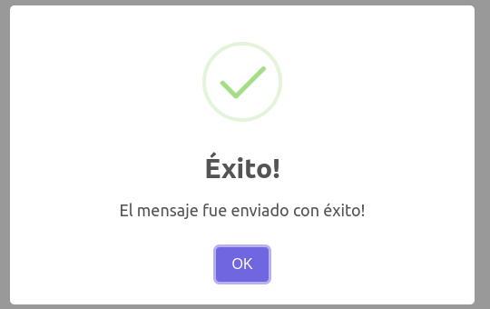
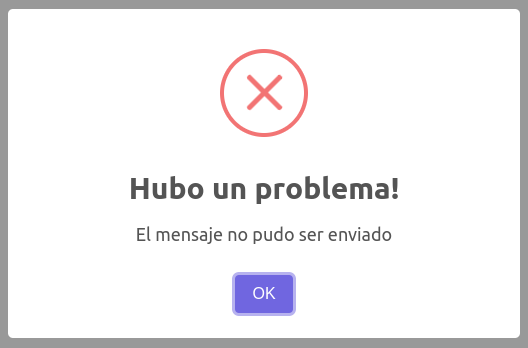
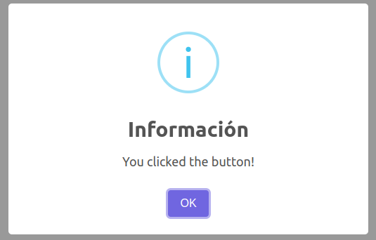
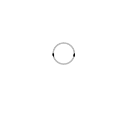

# Proyecto para la ONG Somos Mas

Se creo un sitio web que sea su carta de presentación donde puedan compartir novedades con la comunidad, contar sobre el trabajo que llevan a cabo, invitar a interesados/as a participar como voluntarios/as o donantes (de dinero o materiales), y donde puedan compartir información (a partir de información recopilada a través de la página) sobre el equipo que esta atrás de cada acción que lleva a cabo la organización. La página cuenta con una vista publica y un panel de administrador donde van a poder administrar el sitio web de manera independiente.

## Tegnologias implementadas

React, Redux-toolkit, Sass, Axios, Formik, ckeditor, mercado pago

### Componente Skeleton

Para usar el componente Skeleton personalizado seguir estos pasos.

Importar el componente Skeleton, está ubicado en carpeta /features/skeleton/Skeleton.

    import Skeleton from './features/skeleton/Skeleton'

El componente recibe el parametro 'mode' para responder varios tipos de estructuras.
Adicional en el caso de usar el modo 'groupCards', se puede enviar por props la cantidad de tarjetas que se quiere renderizar, en el parametro 'quantity'. Ej:

    <Skeleton mode='groupCards' quantity='5'>
    ó
    <Skeleton mode='groupCards' quantity={5}>

Listado de modos del componente:

    -singleCard : Renderiza una sola tarjeta en carga
    -groupCards : Renderiza un grupo de tarjetas en carga
    -list : Renderiza una lista o tabla en carga
    -form: Renderiza un formulario en carga

El objetivo es renderizar este componente según la necesidad mientras hay una espera o carga por una respuesta de peticiones.

### `SweetAlert2`

[SweetAlert2](https://sweetalert2.github.io/) es una librería responsive, customizable y accesible que reemplazará las alertas de javascript.

Para implementar estas alertas debemos utilizar los servicios que están en `sweetAlertServices.js`

Por ejemplo:

```javascript
export const postContact = (data) => {
  axios
    .post(API_URL, data)
    .then(() => {
      sweetAlertSuccess("El mensaje fue enviado con éxito!");
    })
    .catch((err) => {
      sweetAlertError("El mensaje no pudo ser enviado");
    });
};
```

Asi se ven los tres tipos de alertas:

- `Para caso de éxito`

  

- `Para caso de error`

  

- `Para caso de información`

  

### Componente Progress

Muestra una barra que da un feedback al usuario mientras se esté cargando un recurso.

El componente ya viene con valores por defecto y se puede utilizar solo.

```
<Progress />
```

Si se desea personalizar se puede hacer mediante props. Se puede modificar el color principal con primaryColor, el color de fondo con backgroundColor, la altura de la barra con height y redondear los bordes con borderRadius

Ejemplo de uso:

```
<Progress primaryColor= "#dc2626" backgroundColor= "#808080" height={10} borderRadius={5} />
```

primaryColor y backgroundColor reciben valores hexadecimales y rgb en formato string.

height y borderRadius reciben valores numericos que se representan en px. height={10} borderRadius={5} representa 10px y 5px respectivamente.

### Componente Spinner

Muestra una animación cuando se cargan los componentes, para darle feedback al usuario.

El componente ya viene con valores por defecto y se puede utilizar solo.



```
<Spinner />
```

Si se desea personalizar se puede hacer mediante props. Se puede modificar el color principal con color, el tamaño con size, y el color secundario con secondaryColor.

Ejemplo de uso:

```
<Spinner color= "#faf" size={100} secondaryColor="#000" />
```

color y secondaryColor recibe un valor hexadecimal.

size recibe un número.
